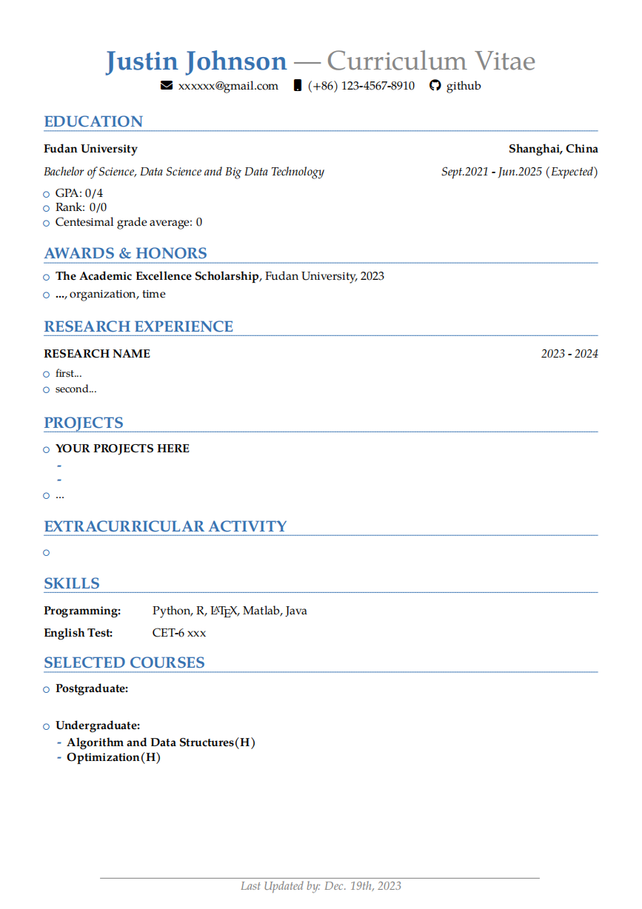

### Curriculum Viate Template
- Snap shot:
   

- You just need to fill in the blank part in the $\LaTeX$ source code and compile it to get the **pdf** file of your cv.
- To make a chinese version of the cv, one can uncomment the following lines and repeat the above procedure with chinese contents.
  ```latex
  L17 \usepackage{CJKutf8} 
  L76 \begin{CJK*}{UTF8}{gbsn}
  ```
- You are welcome to read through the comments on the source code and modify it based on your personal needs.